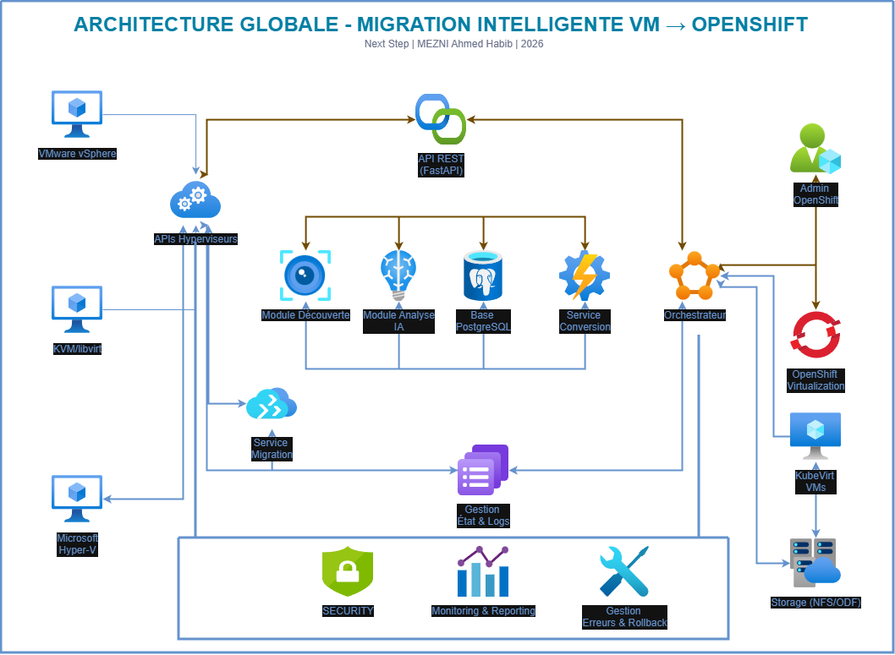

# 🚀 ShiftWise

Plateforme intelligente de migration de VMs vers OpenShift Virtualization.

## ✨ Fonctionnalités
- Découverte automatique des VMs
- Analyse de compatibilité avec IA
- Migration orchestrée
- Monitoring temps réel

## 🏗️ Architecture


## 🚀 Quick Start
```bash
# Backend
cd backend
pip install -r requirements.txt
python init_db.py
uvicorn app.main:app --reload

# Frontend
cd frontend
npm install
npm run dev
```

## 📂 Structure
- `/backend` - API FastAPI + PostgreSQL
- `/frontend` - Interface utilisateur
- `/docs` - Documentation technique

➡️ [Voir le README Backend](./backend/README.md)
➡️ [Voir le README Frontend](./frontend/README.md)